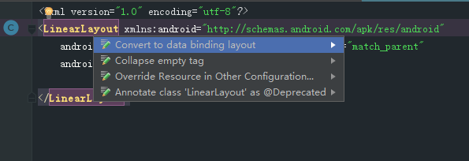
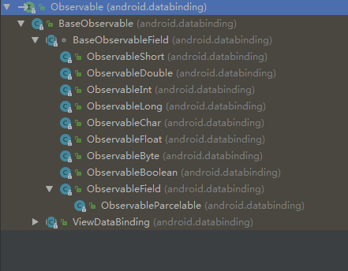

参考：

[Android DataBinding 从入门到进阶](https://juejin.im/post/5b02cf8c6fb9a07aa632146d)

[DataBinding最全使用说明](https://juejin.im/post/5a55ecb6f265da3e4d7298e9#heading-7)

[Android Data Binding（数据绑定）用户指南](https://blog.gokit.info/post/android-data-binding/#7-%E5%B1%9E%E6%80%A7setters)

[Android Data Binding 系列(一) -- 详细介绍与使用](http://connorlin.github.io/2016/07/02/Android-Data-Binding-%E7%B3%BB%E5%88%97-%E4%B8%80-%E8%AF%A6%E7%BB%86%E4%BB%8B%E7%BB%8D%E4%B8%8E%E4%BD%BF%E7%94%A8/)

[Android Data Binding 系列(二) -- Binding与Observer实现原理](http://connorlin.github.io/2016/07/13/Android-Data-Binding-%E7%B3%BB%E5%88%97-%E4%BA%8C-Binding%E4%B8%8EObserver%E5%AE%9E%E7%8E%B0%E5%8E%9F%E7%90%86/)

[databinding文章汇总](http://www.jcodecraeer.com/a/anzhuokaifa/androidkaifa/2015/0811/3290.html)

# 开启dataBinding功能：

``` 
android {
    ....
    dataBinding {
        enabled = true    
    }    
}
```

# 简单示例：

实体类：
``` 
//JavaBeans对象:
public class User {
    private String firstName;
    private String lastName;

    public User(String firstName, String lastName) {
        this.firstName = firstName;
        this.lastName = lastName;
    }

    public String getFirstName() {
        return firstName;
    }

    public void setFirstName(String firstName) {
        this.firstName = firstName;
    }

    public String getLastName() {
        return lastName;
    }

    public void setLastName(String lastName) {
        this.lastName = lastName;
    }
}
```
activity_main.xml：



``` 
<?xml version="1.0" encoding="utf-8"?>
<layout xmlns:android="http://schemas.android.com/apk/res/android">

    <data>
        <!-- 变量user， 描述了一个布局中会用到的属性 -->
        <variable
            name="user"
            type="com.example.mydatabinding.model.User" />
    </data>

    <LinearLayout
        android:layout_width="match_parent"
        android:layout_height="match_parent"
        android:orientation="vertical">

        <TextView
            android:layout_width="wrap_content"
            android:layout_height="wrap_content"
            android:text="@{user.firstName}" />

        <!-- 布局文件中的表达式使用 “@{}” 的语法 -->
        <TextView
            android:layout_width="wrap_content"
            android:layout_height="wrap_content"
            android:text="@{user.lastName}" />
    </LinearLayout>
</layout>
```
activity：
``` 
public class MainActivity extends AppCompatActivity {

    @Override
    protected void onCreate(Bundle savedInstanceState) {
        super.onCreate(savedInstanceState);

        //ActivityMainBinding自动生成
        ActivityMainBinding binding = DataBindingUtil.setContentView(this, R.layout.activity_main);
        binding.setUser(new User("xq", "666"));
    }
}
```

# 




# 警告问题：

```
API 'variantOutput.getProcessResources()' is obsolete and 
has been replaced with 'variantOutput.getProcessResourcesProvider()'.

API'variantOutput.getProcessResources（）'已过时，
已被'variantOutput.getProcessResourcesProvider（）'取代。
```
解决：
```
compile 
替换成：
api 或 implementation
```


